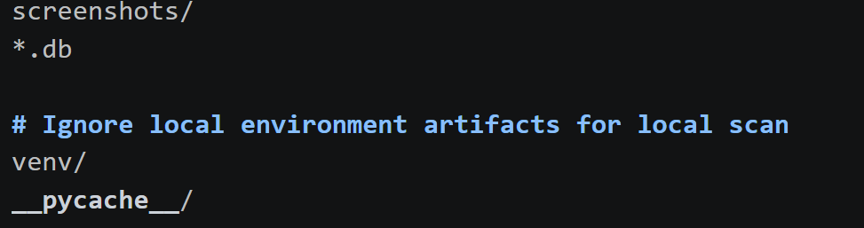
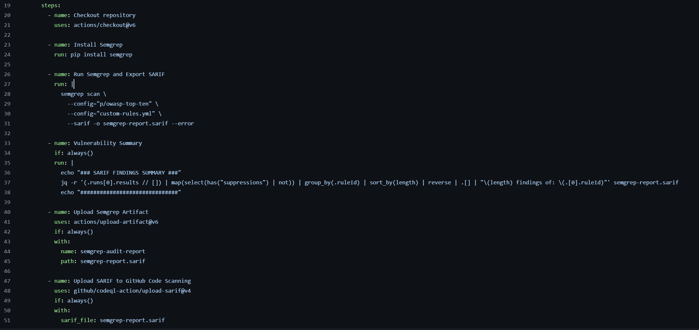
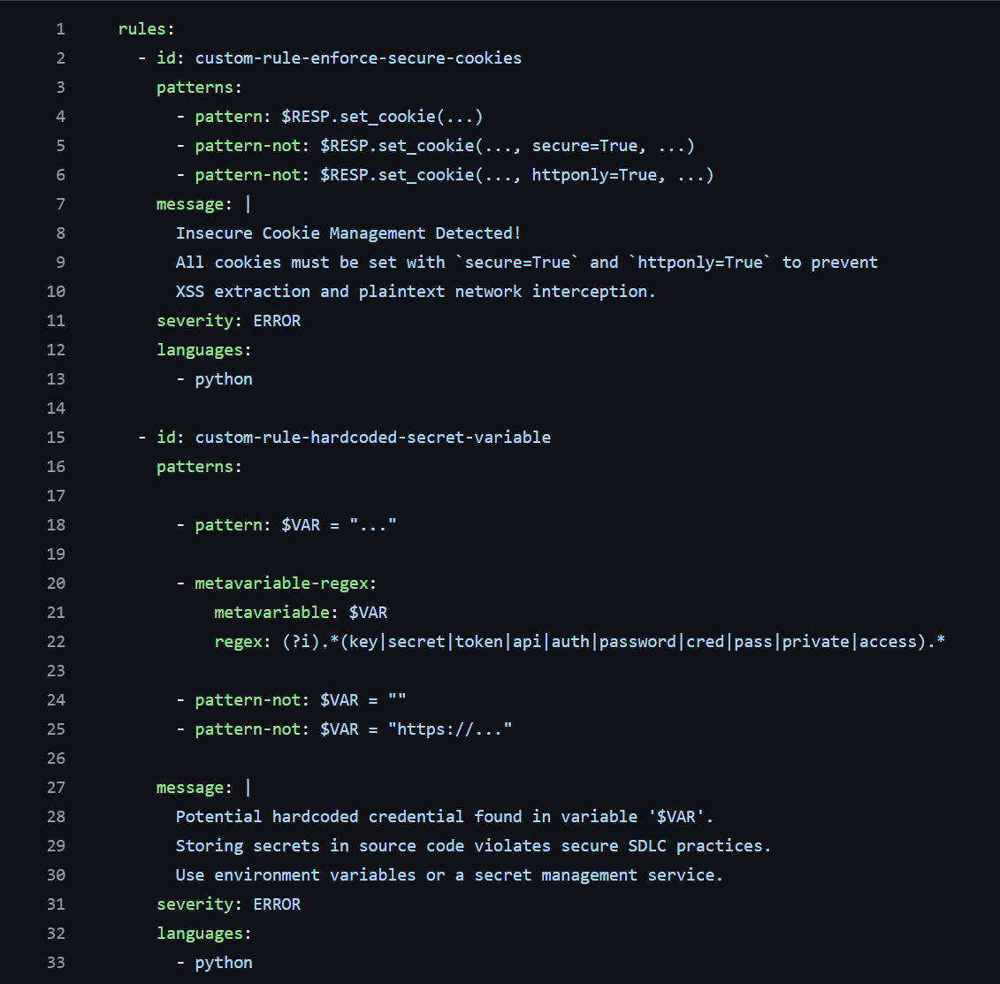
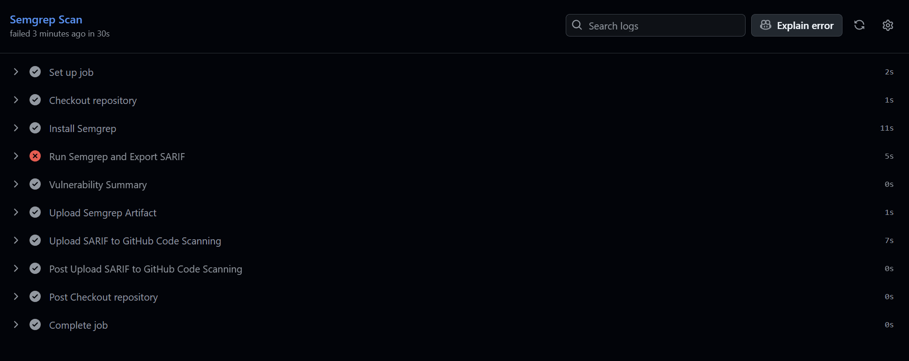
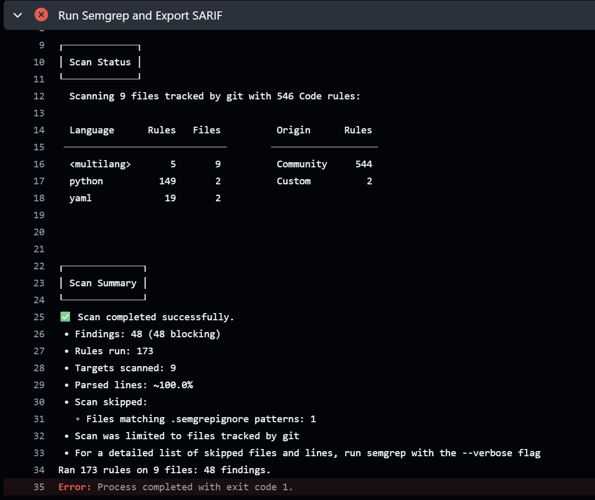
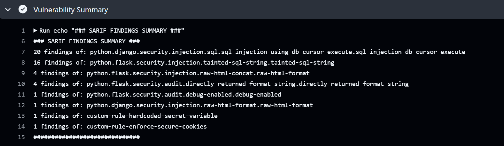
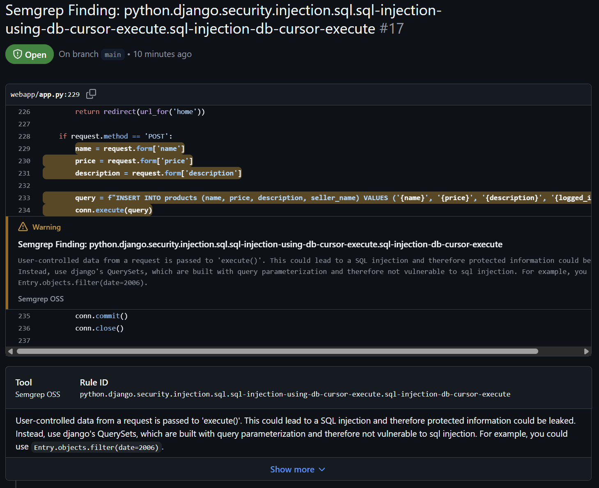
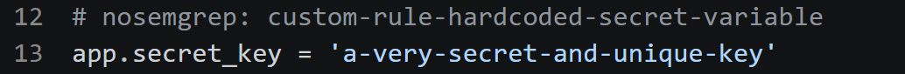
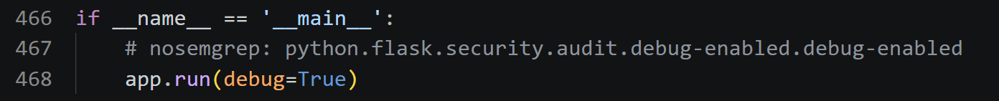
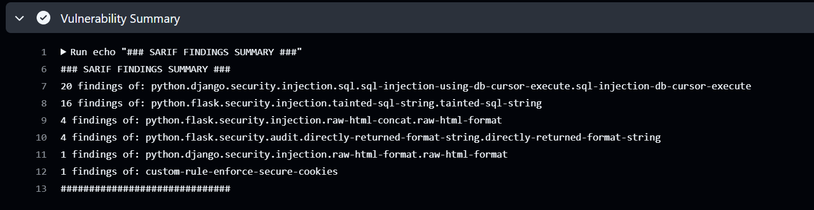

# TASK_C Automated SAST using Semgrep

Semgrep a static analysis engine will be used for identifying the patterns that violate secure coding practices. Findings are exported using the static analysis result interchange format (SARIF).

The main scanning target will be the ```task_c/webapp``` but other content inside the root directory including yml files are also scanned. ```.semgrepignore``` file is created to exclude database file and some local development related files since I was also scanning locally on my machine terminal.


- #### .semgrepignore file


----
## Pipeline architecture

- #### yml file





Standardized the runner environment and installs the Semgrep CLI. Executes semgrep scan with ```p/owasp-top-ten``` rule config and two custom rules. I tried using both json and SARIF for the scan output, and decided to use SARIF since it allows GitHub to render findings directly into the security tab with a proper dynamic management interface. Jq which is a high level domain specific programming language designed for processing JSON data, is used to print out the finding summary overview from the SARIF file. Upload-artifact and upload-sarif actions are also used to ensure audit evidence is preserved.

---

## Custom rules

Two custom rules for hardcoded secrets and insecure cookie configuration are also added to the custom rules file.

- #### custom-rules.yml file



----

## Scanning result 

The scanning pipelines fails as expected since the webapp contains a lot of vulnerabilities. 

- #### Workflow result overview


----

Semgrep found 48 insecure coding practices during the scanning.
- #### Semgrep scan result overview


---

Most of the scanning results are from the "p/owasp-top-ten" rule set while two of them are from my own custom rule.

- #### Jq prints out the simple summary from SARIF file


---

Most the findings are legitimate findings, mainly consist of sql injection and xss related vulnerabilities. All the scanning results are stored inside SARIF file.

- #### SARIF scanning result report file


---

In the security tab of the repo, the scanning result dashboard can be found.

- #### Scanning result dashboard form GitHub


---

Each finding is highly detailed and the exact line and the code snippet are also shown.

- #### Vulnerability detail


---

## False Positives triage and suppression

 Static analysis frequently flags configurations that are technically "vulnerable" but contextually required for a development environment. 

### Hardcoded secret key

The application utilizes a non-sensitive placeholder ```'a-very-secret-and-unique-key'``` string for the local development purpose. The risk is acknowledged and mitigated by using inline # nosemgrep suppression

- #### Suppressing the rule


---

### Flask Debug mode 

Enabling the flask debugger is an operational requirement for the iterative development and testing phase of this project. It provides essential diagnostic features, including an interactive traceback and auto-reloading.

- #### Suppressing the rule


---

Another scan was done after suppressing two rules and in the finding summary overview, we can see both hardcoded and debugger findings are gone, with a total of 46 findings compared to 48 in last scan.

- #### Scan result after suppressing


---

## Quirky interaction when using semgrep scan together with ```---sarif```

If we look at the semgrep scan result after suppressing (picture below), it is still saying 48 even tho it should be 46 since we suppressed two false positives. Normally when we suppress using ```nosemgrep```, we can directly see the differences of finding count between scan results easily. However, when we use the ```--sarif``` flag, Semgrep is forced to obey the strict international SARIF standard. The SARIF standard states that all findings even suppressed ones must be written into the file for "auditing purposes" under a special suppressions array. If we look inside the SARIF output, we can see both of them flagged with ```suppressions``` tag correctly, which is why I was able to filter them out with ```map(select(has("suppressions")``` using jq command during the Vulnerability Summary printing workflow.

- #### semgrep summary


---

**Automated SAST tools are essential for baseline enforcement but remain context-blind, and these tools should not be used as the only security gate in modern software development.**


